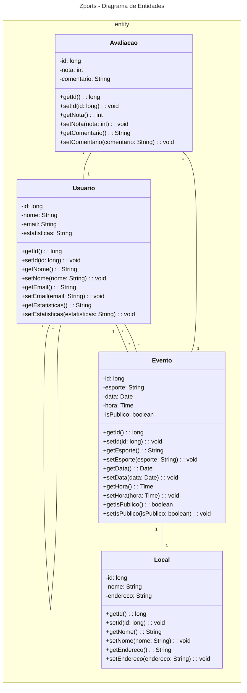

## Fábrica de Software 2025/2
**Jandir Neto** e **Lucas Bobato**

---

### Propostas de projeto
A seguir, uma lista de ideias de projetos para a Fábrica de Software:

<s>

* **App de Corrida para Treinadores e Atletas**
    * Cadastro de atletas e treinadores
    * Criação de treinos personalizados
    * Gerenciamento de treino guiado (via smartwatch ou outros wearables)

* **Ferramenta de Gerenciamento de Projetos e Equipe com IA integrada**
    * Cadastro de equipe e projetos
    * Gerenciamento de tarefas (tasks)
    * Acompanhamento do progresso
    * Revisão de organização com o auxílio de IA

* **Letterboxd de restaurante**
    * Cadastro de usuários e restaurantes
    * Gerenciamento de avaliações e resenhas
    * Programa de fidelidade com os restaurantes

* **App de divulgação e inscrição de corridas de rua**
    * Cadastro de eventos e usuários
    * Compra de ingressos
    * Informações detalhadas sobre o evento e retirada de kits

</s>

* **App para conectar pessoas que desejam praticar esportes coletivos e encontrar locais para jogar** (Rede social de esportes)
    * Cadastro de atletas
    * Criação e gerenciamento de partidas
    * Confirmação de presença
    * Avaliação de atletas e locais

---

### Histórias de Usuário Essenciais

As histórias de usuário ajudam a descrever as funcionalidades do ponto de vista do usuário final, focando em suas necessidades e objetivos. Aqui estão algumas que complementam suas UCs:

#### **Gerenciamento de Eventos e Participação**

Estas histórias se concentram em como os usuários encontram, participam e gerenciam as partidas.

* **Como um usuário, eu quero encontrar eventos públicos** de acordo com o esporte, data e localização, para que eu possa participar de jogos na minha região.
* **Como um usuário, eu quero ver os detalhes de um evento** (esporte, local, data, hora, lista de participantes), para que eu possa decidir se quero participar.
* **Como um usuário, eu quero me juntar a um evento público existente**, para que eu possa confirmar minha presença na partida.
* **Como um usuário, eu quero convidar meus amigos** para um evento privado que criei, para que possamos organizar uma partida juntos.
* **Como um usuário, eu quero deixar um evento** do qual não posso mais participar, para que minha vaga seja liberada para outro jogador.
* **Como o criador de um evento, eu quero cancelar uma partida**, para que os participantes sejam notificados de que o jogo não acontecerá.

#### **Interação Social e Perfil**

Essas histórias descrevem como os usuários se conectam e interagem uns com os outros.

* **Como um usuário, eu quero ter um perfil público** com minhas estatísticas e avaliações, para que outros jogadores possam conhecer meu histórico e habilidades.
* **Como um usuário, eu quero enviar e receber solicitações de amizade**, para que eu possa me conectar com outros atletas que conheci.
* **Como um usuário, eu quero ver o perfil de outros jogadores**, para que eu possa saber mais sobre eles antes de jogar juntos.
* **Como um usuário, eu quero me comunicar com outros participantes de um evento** através de um chat, para que possamos coordenar os detalhes da partida.

#### **Notificações e Feedback**

Estas histórias garantem que o usuário seja informado sobre as atividades relevantes.

* **Como um usuário, eu quero receber notificações** quando sou convidado para um evento ou quando um evento que criei foi alterado, para que eu me mantenha sempre informado.
* **Como um usuário, eu quero receber um lembrete** antes de uma partida, para que eu não me esqueça do evento.
* **Como um usuário, eu quero avaliar a organização de um evento**, para que a comunidade possa saber se o criador é um bom organizador de jogos.
* **Como um usuário, eu quero dar feedback sobre o aplicativo**, para ajudar a melhorar a experiência de uso.

---

### Aula 19/08

