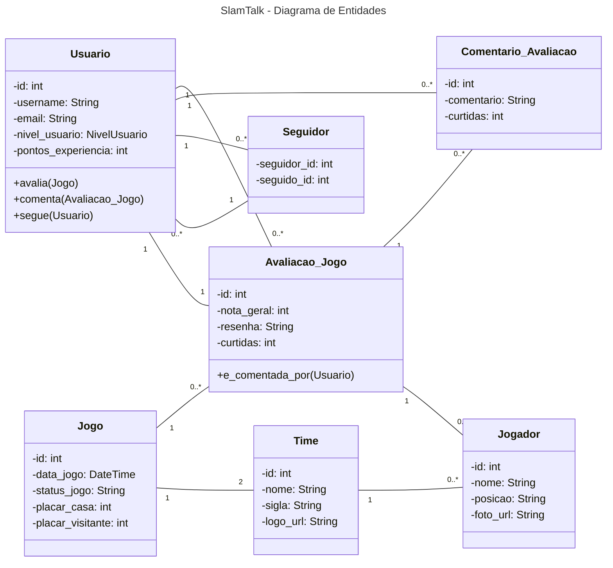

## Fábrica de Software 2025/2
**Jandir Neto** e **Lucas Bobato**

---

### Proposta do Projeto: SlamTalk

**SlamTalk** é uma plataforma social e de estatísticas dedicada a fãs de basquete, com foco principal na NBA. O objetivo é criar uma comunidade engajada onde os usuários possam acompanhar jogos, analisar estatísticas de jogadores e times, compartilhar suas opiniões através de um sistema de avaliação detalhado e interagir com outros fãs.

A plataforma contará com um sistema de gamificação, onde os usuários ganham pontos e desbloqueiam conquistas, incentivando a participação e o debate construtivo sobre as partidas e o desempenho dos atletas.

---

### Histórias de Usuário Essenciais

Estas histórias de usuário descrevem as funcionalidades da plataforma sob a perspectiva do fã de basquete.

#### **Consumo de Dados e Estatísticas**

*   **Como um fã de basquete, eu quero ver o calendário de jogos da NBA**, com datas, horários e times envolvidos, para que eu possa me programar para assistir às partidas.
*   **Como um fã, eu quero visualizar os resultados e placares de jogos já finalizados**, para me manter atualizado sobre a liga.
*   **Como um fã, eu quero acessar o perfil de um jogador**, para ver suas estatísticas da temporada (pontos, rebotes, assistências), informações pessoais (altura, peso, idade) e conquistas na carreira.
*   **Como um fã, eu quero ver a página de um time**, para consultar seu elenco de jogadores (roster), histórico de vitórias/derrotas e prêmios.

#### **Avaliação e Interação Social**

*   **Como um usuário, eu quero criar uma conta e ter um perfil público**, onde posso definir meu time favorito e exibir minhas conquistas na plataforma.
*   **Como um usuário, eu quero avaliar um jogo após seu término**, atribuindo notas para o desempenho ofensivo e defensivo das equipes, a arbitragem e a atmosfera da partida.
*   **Como um usuário, eu quero escrever uma resenha detalhada sobre um jogo**, e eleger o melhor e o pior jogador em quadra, para compartilhar minha análise com a comunidade.
*   **Como um usuário, eu quero comentar nas avaliações de outros fãs**, para debater sobre suas opiniões e iniciar uma discussão.
*   **Como um usuário, eu quero curtir as avaliações e comentários que considero relevantes**.
*   **Como um usuário, eu quero seguir outros usuários** cujo conteúdo eu aprecio, para acompanhar suas atividades futuras.

#### **Gamificação e Notificações**

*   **Como um usuário, eu quero ganhar pontos de experiência e subir de nível** (de "Rookie" a "GOAT") com base nas minhas interações na plataforma (avaliar, comentar, etc.).
*   **Como um usuário, eu quero desbloquear conquistas** por realizar ações específicas (ex: "Avaliar 10 jogos", "Seguir 5 usuários"), para exibir no meu perfil.
*   **Como um usuário, eu quero receber notificações** quando alguém comentar na minha avaliação ou começar a me seguir, para me manter engajado com a comunidade.

---

### Diagrama de Entidades (Modelo Lógico)

